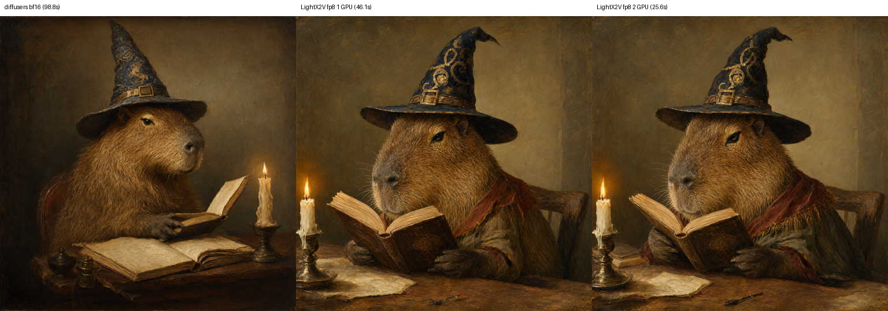

# Qwen-Image-2.1 on RTX 4060 Ti 16 GB

Scripts, configs and notes for running [Qwen-Image-2.1](https://github.com/QwenLM/Qwen-Image-2.1) text-to-image on consumer 16 GB GPUs: two RTX 4060 Ti cards (Ada, sm_89, PCIe only). It includes an interactive prompt client and a [LightX2V](https://github.com/ModelTC/LightX2V) server patch so a cancelled request really stops the GPU work.

The upstream configs target 24–80 GB cards. On 16 GB, the `enable_model_cpu_offload()` tip in the [Qwen-Image-2.1 README](https://github.com/QwenLM/Qwen-Image-2.1#readme) runs out of memory, and LightX2V's RTX 5090 FP8 path is Blackwell-only. This repo works around both.

## Why this repo

This repo is not an inference server. Inference and the REST API come from [LightX2V](https://github.com/ModelTC/LightX2V)'s own FastAPI server (`python -m lightx2v.server`): its task API (`/v1/tasks/...`) and an OpenAI-compatible `/v1/images/generations`. This repo holds the glue needed to make that server run well on 16 GB Ada cards:

| Piece | Why it's needed |
|---|---|
| 16 GB FP8 configs | Upstream configs assume a 32 GB RTX 5090 or datacenter GPUs. They use the Blackwell-only `fp8-f16-accum` kernel and keep the text encoder and DiT on the GPU together, which runs out of memory on 16 GB. |
| Environment setup ([`env.sh`](serve/env.sh)) | The bare server command needs the venv and CUDA on `PATH`, `CUDA_HOME`, offline Hugging Face mode, and LightX2V's `base.sh` variables. |
| Config rendering | Configs need absolute FP8 checkpoint paths. They are filled in at launch from `FP8_DIR`, so no machine-specific path is committed. |
| Multi-GPU launch | The 2-GPU setup (Ulysses sequence parallel plus text-encoder tensor parallel) needs one process per GPU via `torchrun`. |
| Ctrl-C shutdown | With plain torchrun, Ctrl-C hangs ~30 s during a generation and then prints a traceback. |
| [Server patch](#lightx2v-server-patch) | Upstream, cancelling a task does not stop the GPU work, so the next request waits behind it. |
| [Interactive client](serve/prompt_loop.py) | Line editing and history, plus Ctrl-C to cancel a running generation and resubmit an edited prompt. |

Other serving frameworks don't remove the need for this glue. [vLLM-Omni](https://github.com/vllm-project/vllm-omni) and [SGLang](https://github.com/sgl-project/sglang) also serve Qwen-Image-2.1 over REST, but you would still pass FP8, parallelism and memory options to fit 16 GB cards. Neither publishes consumer-GPU numbers, and vLLM-Omni's support needs a PR branch. LightX2V is the only one with consumer-GPU FP8 configs (for the RTX 5090), and they adapt to Ada with the changes above.

## Results

1024×1024, 40 steps, CFG off, same prompt and seed. Times are measured after warm-up and exclude model load.

| Setup | Time per image | Speed-up | Notes |
|---|---|---|---|
| diffusers, bf16, 1 GPU, group offload | 98.8 s | 1.0× | peak VRAM 7.2 GiB, ~41 GB system RAM |
| LightX2V, FP8, 1 GPU | 46.1 s | 2.1× | whole-model swap between text encoder and DiT |
| **LightX2V, FP8, 2 GPUs** | **25.6 s** | **3.9×** | Ulysses sequence parallel plus text-encoder tensor parallel |

4K (3840×2176) also works with the 2-GPU setup.



Diffusers and LightX2V turn the same seed into different starting noise, so the compositions differ. This comparison does not measure FP8's quality loss. The two LightX2V outputs are nearly identical (27.5 dB PSNR).

## Layout

```
$WORK_DIR/
├── qwen-image-rtx4060ti/   # this repo
│   ├── serve/              #   launch scripts, 16 GB configs, prompt client, LightX2V patch
│   └── diffusers/          #   bf16 baseline script
├── LightX2V/               # upstream LightX2V framework clone + .venv (patched); serve/ scripts run it
├── Qwen-Image-2.1/         # optional: official repo + .venv for the diffusers baseline
└── models/                 # FP8 checkpoints converted from the HF weights
```

`WORK_DIR` defaults to the parent of this repo. Override paths with `LIGHTX2V_PATH`, `FP8_DIR`, `MODEL_PATH` and `CUDA_HOME` (see [`serve/env.sh`](serve/env.sh)). The original weights stay in the Hugging Face cache, shared by every venv.

## Setup (LightX2V, FP8)

Tested with LightX2V `8a97c759`, SageAttention `d1a57a5`, torch 2.13.0+cu130, CUDA toolkit 13.3, NVIDIA driver 615, and Python 3.12 managed by [uv](https://github.com/astral-sh/uv). Nothing is installed into the system Python.

```bash
cd "$WORK_DIR"
# Fork = upstream 8a97c759 + the cancel patch, on branch rtx4060ti
git clone -b rtx4060ti https://github.com/Ye99/LightX2V.git
git -C LightX2V remote add upstream https://github.com/ModelTC/LightX2V.git
# (or: clone ModelTC/LightX2V, checkout 8a97c7591d7252ef491392e83e1eb18617ac9368,
#  git apply ../qwen-image-rtx4060ti/serve/patches/lightx2v-cancel-stops-generation.patch)

# sglang-kernel 0.4.8 (FP8 GEMM that runs on Ada) pins torch 2.13.0
cd LightX2V && uv venv .venv --python 3.12
echo "torch==2.13.0" > /tmp/torch-pin.txt
uv pip install --python .venv -c /tmp/torch-pin.txt "torch==2.13.0" torchvision torchaudio \
    "sglang-kernel==0.4.8" "flashinfer-python[cu13]==0.7.0.post1" ninja prompt_toolkit requests -e .

# SageAttention2 (LightX2V uses its Triton int8 kernel on sm_89); PyPI only has v1
cd "$WORK_DIR" && git clone https://github.com/thu-ml/SageAttention.git && cd SageAttention
CUDA_HOME=/usr/local/cuda TORCH_CUDA_ARCH_LIST=8.9 MAX_JOBS=8 \
    uv pip install --python ../LightX2V/.venv --no-build-isolation .

# Weights (33 GB) into the HF cache, then FP8 conversions (~7 GB each)
LightX2V/.venv/bin/hf download Qwen/Qwen-Image-2.1
SRC=$(ls -d ~/.cache/huggingface/hub/models--Qwen--Qwen-Image-2.1/snapshots/*)
cd "$WORK_DIR/LightX2V"
export PATH=$PWD/.venv/bin:/usr/local/cuda/bin:$PATH CUDA_HOME=/usr/local/cuda TORCH_CUDA_ARCH_LIST=8.9
python tools/convert/converter.py --source $SRC/transformer --output ../models/Qwen-Image-2.1-fp8-sgl \
    --output_name qwen_image_21_fp8_sgl --model_type qwen_image_21_dit \
    --quantized --linear_type fp8 --device cuda:0 --single_file
python tools/convert/converter.py --source $SRC/text_encoder --output ../models/Qwen-Image-2.1-qwenvl-language-fp8-sgl \
    --output_name qwen_image_21_qwenvl_language_fp8_sgl --model_type qwen_image_21_text_encoder \
    --quantized --linear_type fp8 --device cuda:0 --single_file
```

## Restore on a new host

Everything except data is in git. Starting from an empty `$WORK_DIR` (default `~/p/qwen-image`):

```bash
mkdir -p ~/p/qwen-image && cd ~/p/qwen-image
git clone git@github.com:Ye99/qwen-image-rtx4060ti.git
git clone -b rtx4060ti git@github.com:Ye99/LightX2V.git
git -C LightX2V remote add upstream https://github.com/ModelTC/LightX2V.git
git -C LightX2V remote set-url --push upstream DISABLED-do-not-push-to-upstream

# LightX2V venv at the exact tested versions, then LightX2V itself and SageAttention2 from source
cd LightX2V && uv venv .venv --python 3.12
uv pip install --python .venv -r ../qwen-image-rtx4060ti/serve/requirements.lock.txt
uv pip install --python .venv --no-deps -e .
cd .. && git clone https://github.com/thu-ml/SageAttention.git && git -C SageAttention checkout d1a57a5
cd SageAttention && CUDA_HOME=/usr/local/cuda TORCH_CUDA_ARCH_LIST=8.9 MAX_JOBS=8 \
    uv pip install --python ../LightX2V/.venv --no-build-isolation . && cd ..
```

Then download the weights and convert the FP8 checkpoints as in [Setup](#setup-lightx2v-fp8) (last block). Optional diffusers baseline: `git clone https://github.com/QwenLM/Qwen-Image-2.1.git`, create `Qwen-Image-2.1/.venv`, and install `diffusers/requirements.lock.txt` into it.

The following are not in git; each can be regenerated:

| Data | Size | How to get it back |
|---|---|---|
| Qwen/Qwen-Image-2.1 weights (HF cache) | 33 GB | `hf download Qwen/Qwen-Image-2.1` |
| FP8 checkpoints (`models/`) | 14.5 GB | the two `converter.py` commands in Setup (~1 min each) |
| venvs, SageAttention build | ~15 GB | the commands above (~10 min) |
| generated images, prompt history (`serve/save_results/`) | small | not reproducible except by re-running the saved prompt and seed in each `.txt`; back up separately if wanted |

## Usage

### Interactive (recommended)

Terminal 1, the server. It compiles once (~60–120 s), listens on 127.0.0.1:8000, and Ctrl-C stops it within a few seconds:

```bash
bash serve/serve_4060ti.sh
```

Terminal 2, the prompt client:

```bash
"$WORK_DIR"/LightX2V/.venv/bin/python serve/prompt_loop.py
```

```text
prompt> seed=7 size=3840x2176 a scuba diver exploring a reef with fish in Florida water
```

- `seed=` and `size=WIDTHxHEIGHT` prefixes are optional; the default is a random seed at 1024×1024. Each side is rounded down to a multiple of 32.
- **Line editing:** arrows, Home/End and Backspace work. ↑/↓ recall history, which is saved between sessions. Ctrl-R searches history, and → accepts the grey suggestion.
- **Ctrl-C while generating** cancels the task on the server, which frees the GPUs within one denoising step. The prompt comes back on the line for editing; press Enter to resubmit.
- Images and a `.txt` file with each prompt, seed and size go to `serve/save_results/interactive/`. The server writes them directly, so the client must run on the same machine.

### One-shot

```bash
NGPU=2 PROMPT="a red fox in snow" SEED=1 bash serve/run_4060ti.sh   # NGPU=1 for a single card
```

### Diffusers bf16 baseline

[`diffusers/test_t2i.py`](diffusers/test_t2i.py) runs in a venv with `torch`, `transformers>=5.17`, diffusers from git, `accelerate`, `pillow` and `torchvision`:

```bash
HF_HUB_OFFLINE=1 CUDA_VISIBLE_DEVICES=0 PYTORCH_CUDA_ALLOC_CONF=expandable_segments:True python diffusers/test_t2i.py
```

## What was needed on 16 GB cards

- **Diffusers needs `torchvision`.** The Requirements section of the [Qwen-Image-2.1 README](https://github.com/QwenLM/Qwen-Image-2.1#readme) doesn't list it. Without it, loading the pipeline fails with `Qwen3VLVideoProcessor requires the Torchvision library`.
- **`enable_model_cpu_offload()` runs out of memory.** The bf16 text encoder alone is 16.3 GiB. Use group offload instead: block-level for the transformer and leaf-level for the text encoder. Block-level grouping never releases the text encoder's blocks.
- **`fp8-f16-accum` is SM120-only.** LightX2V's RTX 5090 configs use it. On Ada use `fp8-sgl` with a **full-range** FP8 checkpoint: convert without `--quantization_profile`. The f16-accum profile narrows weights to qmax 14.
- **The FP8 DiT (6.8 GB) and FP8 text encoder (7.7 GB) don't fit on one card with activations.**
  - 1 GPU: `cpu_offload` with `offload_granularity: "model"`.
  - 2 GPUs: text encoder split by tensor parallelism and still offloaded after encoding, DiT replicated with Ulysses SP.
- **The converter JIT-compiles a CUDA extension.** It needs `ninja`, which is missing from LightX2V's `pyproject.toml`.

## LightX2V server patch

[`serve/patches/lightx2v-cancel-stops-generation.patch`](serve/patches/lightx2v-cancel-stops-generation.patch) (also committed on the [`rtx4060ti` branch of Ye99/LightX2V](https://github.com/Ye99/LightX2V/tree/rtx4060ti)) fixes cancelling. Upstream, `DELETE /v1/tasks/{id}` (and a client disconnecting from `/sync`) only marks the task cancelled while the GPUs keep generating, so the next request waits behind it. The patch sets the runner's `stop_signal` when the task being processed is cancelled. `runner.check_stop()` already broadcasts that flag from rank 0 every step, so all ranks abort together and the worker returns `failed` cleanly.

`serve_4060ti.sh` also replaces torchrun's Ctrl-C handling. That handling hangs ~30 s when a request is in flight, because rank 1 exits immediately while rank 0 waits in an NCCL collective, and then prints a traceback. The script instead cancels running tasks, drops torchrun, SIGTERMs the workers by PID (torchrun starts each in its own session), and SIGKILLs any worker still alive after `STOP_TIMEOUT`.

### Updating LightX2V while keeping the patch

```bash
cd "$WORK_DIR/LightX2V"
git fetch upstream
git rebase upstream/main            # replays the patch commit on top of the latest upstream
git push --force-with-lease origin rtx4060ti
```

Re-check the [setup](#setup-lightx2v-fp8) pins after a rebase. Upstream may move past the torch 2.13 / sglang-kernel 0.4.8 combination tested here.

## License

The scripts, configs and patch in this repo are under the [MIT License](LICENSE). The Qwen-Image-2.1 weights are under the Qwen Research License, and LightX2V and SageAttention are Apache-2.0. Follow their terms when you use them.
